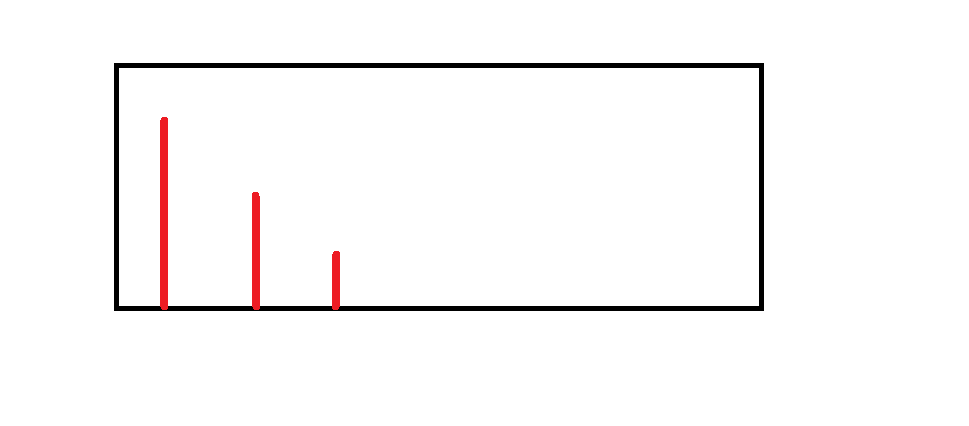

### Deque trick

Extremely useful to find next greater or previous greater, etc
* https://leetcode.com/problems/next-greater-element-i/
* https://leetcode.com/problems/online-stock-span/
* https://leetcode.com/problems/sliding-window-maximum/

The idea is to maitain a queue or stack based on our requirements that has this structure: <br />
 <br />
We might want to add some more info (eg. location) <br />
Each incoming element will be compared with the last element: <br />
* Keep on popping if stack/queue and the last element is smaller than the current one
* Go ahead and append it to the stack/queue

For next greater, run the loop backwards and for the sliding window question, <br />
pop the first one if it's outside of the window boundaries (< `(i - k + 1)`)

General solution: 
```py
from collections import deque

class StockSpanner:

    def __init__(self):
        self.queue = deque()
        self.counter = 0

    def next(self, price: int) -> int:
        self.counter += 1
        result = self.counter
        
        while self.queue and self.queue[-1][0] <= price:
            self.queue.pop()
        
        if self.queue:
            result = self.counter - self.queue[-1][1]
        
        self.queue.append((price, self.counter))
        return result
```
Next greater
```py
from collections import defaultdict

class Solution:
    def nextGreaterElement(self, nums1: List[int], nums2: List[int]) -> List[int]:
        store = defaultdict(int)
        stack = []
        result = []
        
        for i in range(len(nums2) - 1, -1, -1):
            store[nums2[i]] = -1
            
            while stack and stack[-1] < nums2[i]:
                stack.pop()
            
            if stack:
                store[nums2[i]] = stack[-1]
            
            stack.append(nums2[i])
            
        for num in nums1:
            if store[num]:
                result.append(store[num])
            else:
                result.append(-1)
                
        return result
```
Sliding window solution: 
```py
from collections import deque

class Solution:
    def maxSlidingWindow(self, nums: List[int], k: int) -> List[int]:
        queue = deque()
        result = []
        
        if k == 1:
            return nums
        
        if k == len(nums):
            return [max(nums)]
        
        for i in range(0, k):
            while queue and nums[queue[-1]] < nums[i]:
                queue.pop()
            queue.append(i)
        
        result.append(nums[queue[0]])
        
        for i in range(k, len(nums)):            
            if queue[0] < (i - k + 1):
                queue.popleft()
                
            while queue and nums[queue[-1]] < nums[i]:
                queue.pop()
                
            queue.append(i)
            result.append(nums[queue[0]])
            
        return result
```