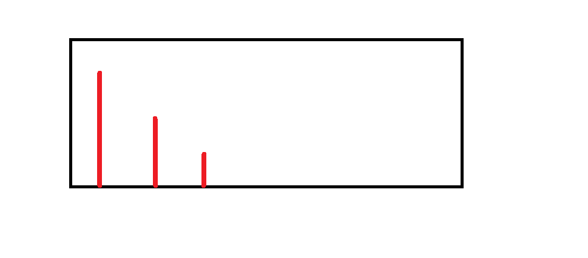

### Stacks / Deque trick / monoqueue technique

Main concepts here:
###### Knuth stack-sorting (132 pattern)
* https://leetcode.com/problems/132-pattern/
###### deque trick
* https://leetcode.com/problems/next-greater-element-i/
* https://leetcode.com/problems/online-stock-span/
* https://leetcode.com/problems/sliding-window-maximum/
* https://leetcode.com/explore/challenge/card/may-leetcoding-challenge/536/week-3-may-15th-may-21st/3330/

The idea is to maitain a queue or stack based on our requirements that has this structure: <br />
 <br />
We might want to add some more info (eg. location) <br />
Each incoming element will be compared with the last element: <br />
* Keep on popping if stack/queue and the last element is smaller than the current one
* Go ahead and append it to the stack/queue
* The element that displaces stack element is the next greater for the elem that got displaced
* The stack elements at the end have no next greaters

It's all a game of displacing elements in the stack and interpretation of the ones that are left in it. <br />
Scenarios: 
* A bigger element comes next: will displace and add their displacements.
* Equal: will displace some; we take their displacements and add.
* Smaller: didn't displace anything. 
General solution: 
```py
class StockSpanner:

    def __init__(self):
        self.stack = []

    def next(self, price: int) -> int:
        displaced = 1
        while self.stack and self.stack[-1][0] <= price:
            _, new_displacement = self.stack.pop()
            displaced += new_displacement
        
        self.stack.append((price, displaced))
        return displaced
```
Great question:
https://leetcode.com/problems/find-the-most-competitive-subsequence/ <br />
We need to select k smallest nums one after another. <br />
`additional` is the key here.
```py
class Solution:
    def mostCompetitive(self, nums: List[int], k: int) -> List[int]:
        stack = []
        additional = len(nums)-k
        
        for i, n in enumerate(nums):
            while stack and stack[-1] > n and additional > 0:
                stack.pop()
                additional -= 1
            
            stack.append(n)
        
        return stack[:k]
```
Next greater
```py
from collections import defaultdict

class Solution:
    def nextGreaterElement(self, nums1: List[int], nums2: List[int]) -> List[int]:
        store = defaultdict(int)
        stack = []
        result = []
        
        for i in range(len(nums2) - 1, -1, -1):
            store[nums2[i]] = -1
            
            while stack and stack[-1] < nums2[i]:
                stack.pop()
            
            if stack:
                store[nums2[i]] = stack[-1]
            
            stack.append(nums2[i])
            
        for num in nums1:
            if store[num]:
                result.append(store[num])
            else:
                result.append(-1)
                
        return result
```
Sliding window solution: <br /> 
A simple question first- <br />
Our target is very similar here: <br />
https://leetcode.com/problems/number-of-recent-calls/
```py
from collections import deque

class RecentCounter:

    def __init__(self):
        self.window = deque()

    def ping(self, t: int) -> int:
        while self.window and self.window[0] < (t - 3000):
            self.window.popleft()
        
        self.window.append(t)
        return len(self.window)
```
Now the original question with sliding window <br />
Always remember: <br />
* DRY: Don't Repeat Yourself
* Augmentation here: pop the first elem if it's out of the window
```py
from collections import deque

class Solution:
    def maxSlidingWindow(self, nums: List[int], k: int) -> List[int]:
        stack = deque()
        result = []
        
        if len(nums) <= k:
            return [max(nums)]
        
        for i, e in enumerate(nums):
            if stack and stack[0][1] <= (i - k):
                stack.popleft()
            
            while stack and stack[-1][0] <= e:
                stack.pop()
            
            stack.append((e, i))
            if i >= (k - 1):
                result.append(stack[0][0])
                
        return result
```
https://leetcode.com/problems/largest-rectangle-in-histogram/
```py
from collections import deque
from enum import IntEnum

class Solution:
    def largestRectangleArea(self, heights: List[int]) -> int:
        class Direction(IntEnum):
            L = 0
            R = 1
        
        n = len(heights)
        
        smaller = [[i, i] for i in range(0, n)]
        queue = deque()
        queue.append((-1, -1))
        
        for i, h in enumerate(heights):
            while queue and h <= queue[-1][1]:
                queue.pop()
            
            smaller[i][Direction.L] = queue[-1][0]
            queue.append((i, h))
        
        queue = deque()
        queue.append((n, -1))
        for i in range(len(heights) - 1, -1, -1):
            while queue and heights[i] <= queue[-1][1]:
                queue.pop()
            
            smaller[i][Direction.R] = queue[-1][0]
            queue.append((i, heights[i]))
        
        print(smaller)
        max_area = 0
        for i, w in enumerate(smaller):
            max_area = max(max_area, \
                           (w[Direction.R] - w[Direction.L] - 1) \
                           * heights[i])
            
        return max_area
```