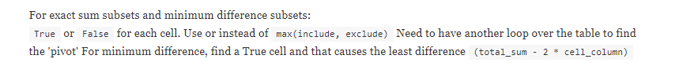

### Subsets

Geeks for Geeks archives: https://www.geeksforgeeks.org/tag/subset/  

For each element, there are 2 choices: 1. Take or 2. leave  
Two ways to implement this:  
1. Recursion
2. DP

#### Standard questions
https://www.geeksforgeeks.org/partition-problem-dp-18/
1. `isSubsetSum(list, n, sum / 2) = isSubsetSum(list, n - 1, sum / 2) or isSubsetSum(list, n - 1, sum / 2 - list[n - 1])`

2.    

