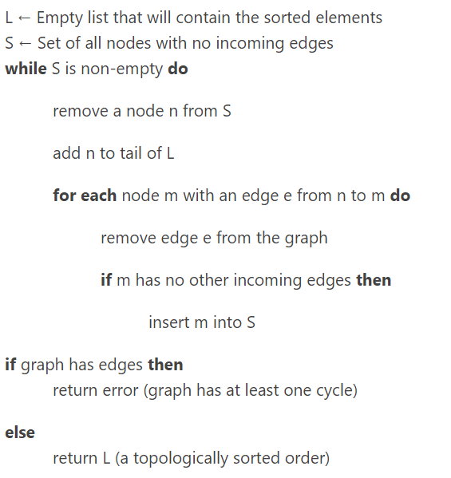

### Topology Sort

 <br />
https://leetcode.com/problems/course-schedule-ii/
```py
from collections import deque, defaultdict

class Solution:
    def findOrder(self, numCourses: int, prerequisites: List[List[int]]) -> List[int]:
        graph = defaultdict(set)
        incoming = defaultdict(set)
        queue = deque()
        u_set = set(range(0, numCourses))
        topo = []
        
        for c, p in prerequisites:
            graph[c].add(p)
            incoming[p].add(c)
            
            if p in u_set:
                u_set.remove(p)
        
        for node in u_set:
            queue.append(node)
            
        while queue:
            node = queue.popleft()
            topo.append(node)
            
            for nei in graph[node]:
                incoming[nei].remove(node)
                
                if not incoming[nei]:
                    queue.append(nei)
        
        return topo[::-1] if len(topo) == numCourses else []
```